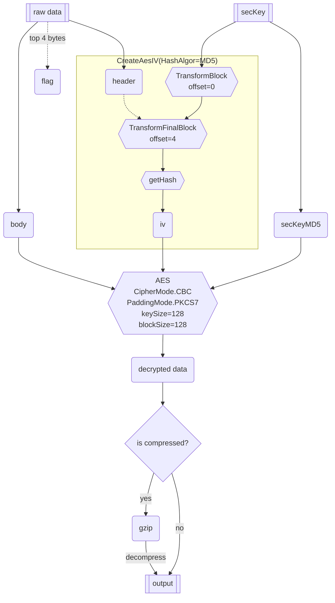

```mermaid
flowchart TB

%% instance %%
rawData[[raw data]]
flag(flag)
body(body)
secKey[[secKey]]
secMD5(secKeyMD5)
output[[output]]
decryptedData(decrypted data)

%% functions %%
aesDecrypt{{AES\n CipherMode.CBC\n PaddingMode.PKCS7\n keySize=128\nblockSize=128}}

%% flows %%
rawData -. top 4 bytes .-> flag
rawData --> header
rawData --> body
body --> aesDecrypt
aesDecrypt --> decryptedData
secKey --> TransformBlock
output_iv --> aesDecrypt
secKey --> secMD5
secMD5 --> aesDecrypt

decryptedData --> condition{is compressed?} 
condition -- yes --> compressMethod(gzip) -- decompress --> output
condition -- no --> output

subgraph "CreateAesIV(HashAlgor=MD5)"
    direction LR

    header(header)
    output_iv(iv)

    TransformBlock{{TransformBlock\n offset=0}}
    TransformFinalBlock{{TransformFinalBlock\n offset=4}}
    getHash{{getHash}}
    
    header .-> TransformFinalBlock
    TransformBlock --> TransformFinalBlock
    TransformFinalBlock --> getHash
    getHash --> output_iv
end
```
